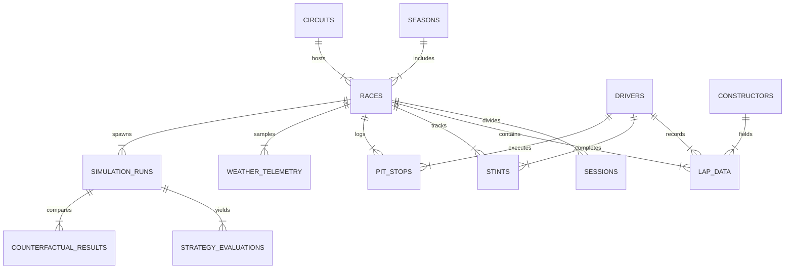

# PITWALL — Database Architecture & ERD Specification

`docs/DATABASE.md`

---

## 1. Hybrid Analytical Database Architecture

PITWALL utilizes a **Hybrid DuckDB + Parquet Analytical Architecture** optimized for high-speed columnar filtering, rolling lap window aggregations, and sub-second Monte Carlo seed queries:

- **DuckDB Core (`data/pitwall.duckdb`)**: Embedded columnar OLAP database handling all lap times, sector telemetry, tyre wear vectors, and historical stint features. DuckDB provides vectorized SQL execution, seamless Pandas/Polars zero-copy interoperability, and single-file serverless deployment.
- **Parquet Cache Layer (`data/parquet/`)**: Compressed, partitioned storage for raw lap telemetry and simulation iteration snapshots (`data/parquet/simulations/race_{id}_lap_{lap}.parquet`).
- **SQLite Configuration Store (`data/config.db`)**: Optional lightweight KV store for persistent UI user preferences, saved counterfactual scenarios, and benchmark audit runs.

```
┌─────────────────────────────────────────────────────────┐
│                    PITWALL Data Layer                   │
├────────────────────────────┬────────────────────────────┤
│  DuckDB (OLAP Analytical)  │   Parquet (Simulation Cache│
│   - Races, Laps, Stints    │   - Monte Carlo Outputs    │
│   - Feature vectors        │   - 10k Iteration Tracks   │
└──────────────┬─────────────┴──────────────┬─────────────┘
               │                            │
               ▼                            ▼
┌─────────────────────────────────────────────────────────┐
│              FastAPI Engine & ML Ingest                 │
└─────────────────────────────────────────────────────────┘
```

---

## 2. Entity Relationship Diagram (ERD)



---

## 3. Detailed Table Schemas (DuckDB DDL)

### 3.1 `circuits`
```sql
CREATE TABLE IF NOT EXISTS circuits (
    circuit_id VARCHAR PRIMARY KEY,
    name VARCHAR NOT NULL,
    location VARCHAR,
    country VARCHAR,
    latitude DOUBLE,
    longitude DOUBLE,
    length_km DOUBLE NOT NULL,
    turns INT,
    pit_lane_loss_sec DOUBLE NOT NULL DEFAULT 22.0,
    base_degradation_mult DOUBLE DEFAULT 1.0
);
```

### 3.2 `races`
```sql
CREATE TABLE IF NOT EXISTS races (
    race_id VARCHAR PRIMARY KEY,
    year INT NOT NULL,
    round INT NOT NULL,
    circuit_id VARCHAR REFERENCES circuits(circuit_id),
    name VARCHAR NOT NULL,
    date DATE NOT NULL,
    total_laps INT NOT NULL,
    official_winner_driver_id VARCHAR
);
```

### 3.3 `drivers`
```sql
CREATE TABLE IF NOT EXISTS drivers (
    driver_id VARCHAR PRIMARY KEY,
    code VARCHAR(3) UNIQUE NOT NULL,
    permanent_number INT,
    first_name VARCHAR,
    last_name VARCHAR,
    nationality VARCHAR
);
```

### 3.4 `constructors`
```sql
CREATE TABLE IF NOT EXISTS constructors (
    constructor_id VARCHAR PRIMARY KEY,
    name VARCHAR NOT NULL,
    nationality VARCHAR
);
```

### 3.5 `lap_data` (Core Analytical Fact Table)
```sql
CREATE TABLE IF NOT EXISTS lap_data (
    race_id VARCHAR NOT NULL,
    driver_id VARCHAR NOT NULL,
    constructor_id VARCHAR NOT NULL,
    lap_number INT NOT NULL,
    position INT,
    lap_time_sec DOUBLE,
    sector1_sec DOUBLE,
    sector2_sec DOUBLE,
    sector3_sec DOUBLE,
    speed_st DOUBLE,
    compound VARCHAR(15),
    tyre_age_laps INT,
    stint_number INT,
    is_pit_lap BOOLEAN DEFAULT FALSE,
    is_accurate BOOLEAN DEFAULT TRUE,
    track_status VARCHAR(10) DEFAULT '1',
    gap_to_leader_sec DOUBLE,
    interval_to_ahead_sec DOUBLE,
    PRIMARY KEY (race_id, driver_id, lap_number)
);
```

### 3.6 `pit_stops`
```sql
CREATE TABLE IF NOT EXISTS pit_stops (
    race_id VARCHAR NOT NULL,
    driver_id VARCHAR NOT NULL,
    stop_number INT NOT NULL,
    lap_number INT NOT NULL,
    duration_sec DOUBLE NOT NULL,
    total_pit_lane_time_sec DOUBLE,
    PRIMARY KEY (race_id, driver_id, stop_number)
);
```

### 3.7 `weather_telemetry`
```sql
CREATE TABLE IF NOT EXISTS weather_telemetry (
    race_id VARCHAR NOT NULL,
    timestamp TIMESTAMP NOT NULL,
    air_temp_c DOUBLE,
    track_temp_c DOUBLE,
    humidity_pct DOUBLE,
    pressure_mbar DOUBLE,
    rainfall_flag BOOLEAN DEFAULT FALSE,
    PRIMARY KEY (race_id, timestamp)
);
```

### 3.8 `simulation_runs`
```sql
CREATE TABLE IF NOT EXISTS simulation_runs (
    simulation_id VARCHAR PRIMARY KEY,
    race_id VARCHAR NOT NULL,
    target_driver_id VARCHAR NOT NULL,
    decision_lap INT NOT NULL,
    num_iterations INT NOT NULL DEFAULT 5000,
    created_at TIMESTAMP DEFAULT CURRENT_TIMESTAMP,
    seed INT DEFAULT 42
);
```

### 3.9 `strategy_evaluations`
```sql
CREATE TABLE IF NOT EXISTS strategy_evaluations (
    evaluation_id VARCHAR PRIMARY KEY,
    simulation_id VARCHAR REFERENCES simulation_runs(simulation_id),
    strategy_code VARCHAR NOT NULL, -- e.g., 'PIT_NOW_HARD', 'STAY_OUT'
    planned_pit_laps VARCHAR, -- e.g., '[32]'
    expected_finish_pos DOUBLE NOT NULL,
    win_probability DOUBLE NOT NULL,
    podium_probability DOUBLE NOT NULL,
    points_probability DOUBLE NOT NULL,
    dnf_probability DOUBLE NOT NULL,
    position_p10 DOUBLE,
    position_p50 DOUBLE,
    position_p90 DOUBLE,
    regret_vs_optimal DOUBLE NOT NULL DEFAULT 0.0
);
```

---

## 4. Analytical Indexing & Optimization Strategy

1. **Composite Primary Keys**: Enforces entity integrity on multi-tenant race tables (`race_id`, `driver_id`, `lap_number`).
2. **Columnar Compression**: DuckDB auto-compresses telemetry columns using ZSTD / Bitpacking, reducing disk memory footprint from ~2GB raw JSON to ~140MB DuckDB binary.
3. **Pre-computed View `v_race_state_snapshot`**: Materializes exact race state \( \text{RaceState}(t) \) at lap \( t \) including current position, compound, tyre age, and gap vectors for instant simulation initial condition bootstrapping.
